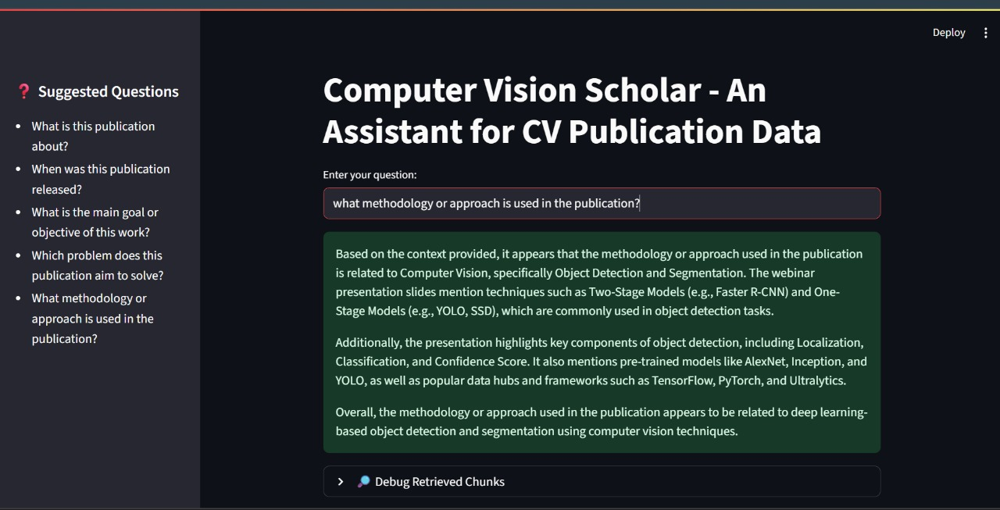

# ComputerVision-Rag-Publication-Assistant

A Computer Vision publication RAG assistant that answers questions about a Ready Tensor publication using: 
- LangChain
- FAISS for retrieval
- HuggingFace sentence-transformers embeddings
- LLaMA (via Ollama) for generation - Streamlit UI for interaction.

SUDARSHAN MADDI 
suddhumaddi@gmail.com
